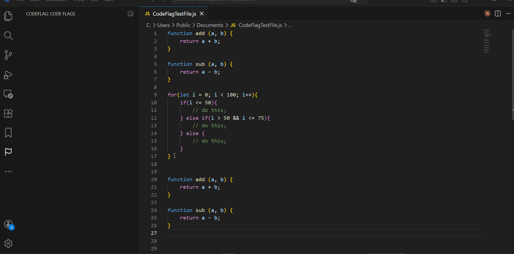
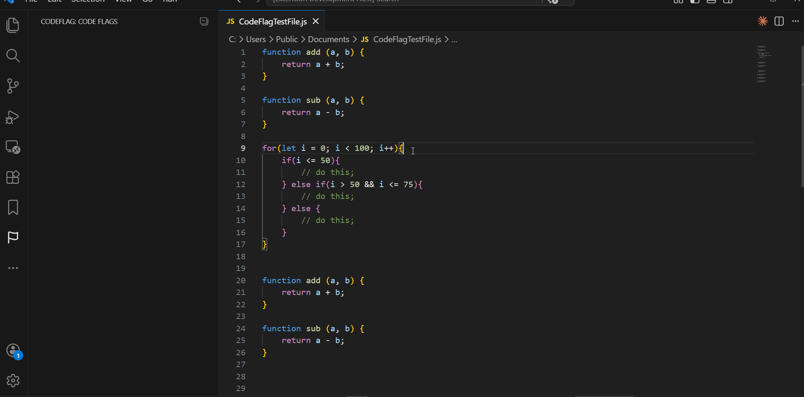
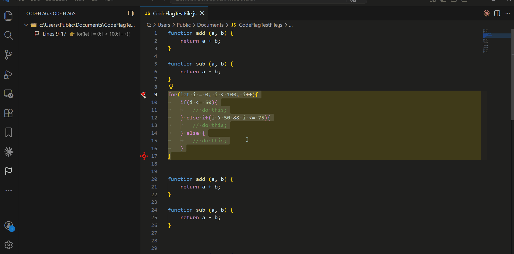
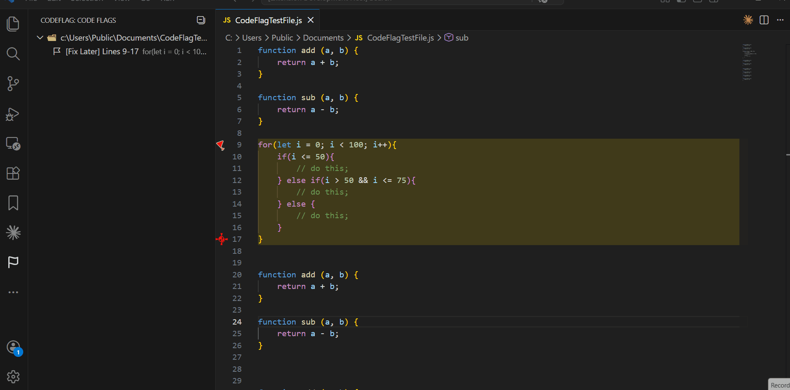
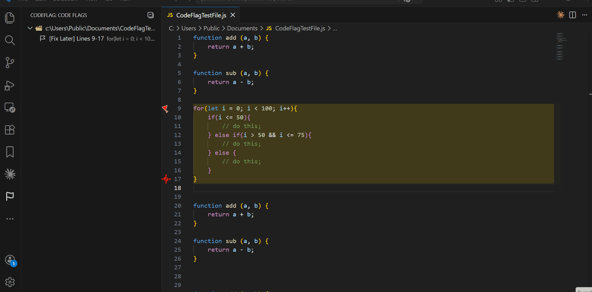

# CodeFlag
Easily add, manage, and navigate flags (bookmarks) in your code for faster development.

---

## Table of Contents
- [Quick Start](#quick-start)  
- [Features Highlights](#features-highlights)  
- [Detailed Usage](#detailed-usage)  
  - [Add a Flag](#add-a-flag)  
  - [Remove a Flag](#remove-a-flag)  
  - [Rename a Flag](#rename-a-flag)  
  - [Keyboard Shortcuts](#keyboard-shortcuts)  
- [Screenshots](#screenshots)  
- [Release Notes](#release-notes)  

---

## Quick Start

1. **Add a Flag**
   - Single-line: Place cursor → Right-click → **Add Flag**  
   - Multi-line: Select lines → Right-click → **Add Flag**

2. **Remove a Flag**
   - Editor: Right-click flagged line → **Remove Flag**  
   - Activity Bar: Hover → Click **Remove**

3. **Rename a Flag**
   - Hover over a flag → Click **Rename** → Enter new name

4. **Keyboard Shortcuts**
   | Action      | Shortcut        |
   |------------|----------------|
   | Add Flag    | Ctrl + Alt + F |
   | Remove Flag | Ctrl + Alt + U |

---

## Features Highlights

- Add, remove, and rename flags quickly  
- Named bookmarks for easy navigation  
- **Smart flag merging:**  
  - Flagging a subset of an existing flag is **ignored**  
  - Flags that include smaller flagged blocks **merge** into one larger block  
- **Activity Bar preview:** Hover over a flag to preview the flagged code  
- Fully supports single-line and multi-line selections  

---

## Detailed Usage

### Add a Flag

**Single-line**
1. Place your cursor on the line you want to flag  
2. Right-click and select **"Add Flag"**

**Multi-line**
1. Select multiple lines of code  
2. Right-click the selection  
3. Select **"Add Flag"**

---

### Remove a Flag

**From Editor**
1. Right-click on a flagged line  
2. Select **"Remove Flag"**

**From Activity Bar**
1. Hover over the flagged item  
2. Click the **Remove** option  

---

### Rename a Flag
1. Hover over the flagged item  
2. Click the **Rename** option  
3. Enter a new name or description  

---

### Keyboard Shortcuts

| Action        | Shortcut        |
|---------------|----------------|
| Add Flag      | Ctrl + Alt + F |
| Remove Flag   | Ctrl + Alt + U |

---

## Screenshots

**Add Flag: Multi-line**  
  

**Add Flag: Single-line**  
  

**Remove Flag**  
  

**Remove Flag: Activity Bar**  
  

**Rename Flag: Activity Bar**  
  

---

## Release Notes

### 1.0.0
- Initial release